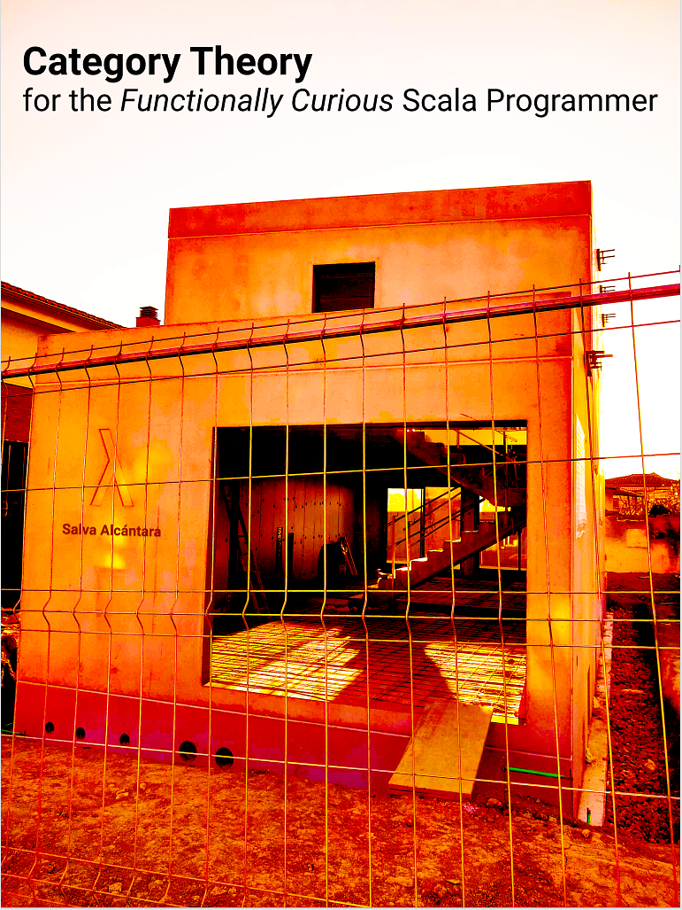
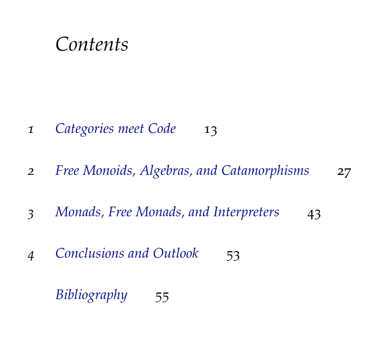

# Functionally Curious

This is the accompanying repo for my Final Year Project (FYP) in Mathematics@[UAB](https://www.uab.cat).
The code is kept to a minimum, really, since the focus in on the concepts. After the dissertation, I'm planning to
self-publish the FYP as a book.

> This book covers essential Category Theory for any programmer who is *functionally curious*.
> It's only a small bridge to *the fantasy land*, so to speak. Once you reach the summit of the Free Monad,
> it's up to you what to do next: some will continue hiking on their own; and some will content themselves
> with this elevated view and rapidly initiate the descent. In any case, it's my hope that this book will
> provide at least some insights that will help you in your programming journey, whatever your inclinations
> and preferences.
> 
> *Become who you are!*―Zarathustra

Tentative timeline:
- Write thesis (done)
- Defend FYP (due in early September 2021)
- Self-publish it in [gumroad](https://gumroad.com)

The first version of the book will consist of the FYP thesis document *as it is*, whose outline is

> You'll get a short (around 50 pages) book where math and code are intertwined in a continuum which leads to
> Functional Programming explained under the light of categorial thinking—the gist of it!

In subsequent versions, I will:
- Expand on Chapter 3
- Most probably, also add some appendices and migrate all the code to Scala 3
